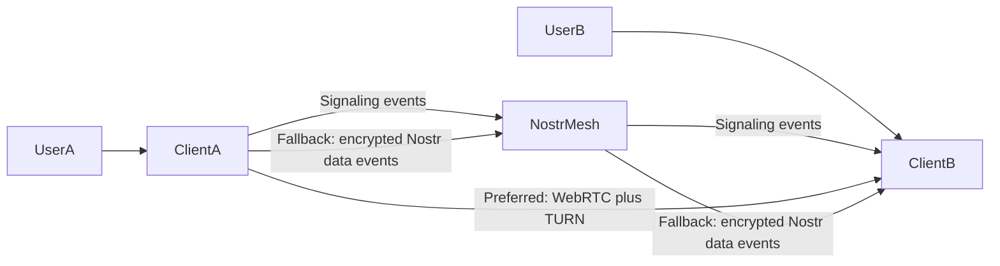

# Reliable Peer Transport Plan

Implement task-by-task. Do not weaken encryption to improve connectivity. The product requirement is reliable transport **and** quantum-safe end-to-end encryption.

## Reader And Outcome

This plan is for the engineer implementing the next transport milestone. After reading it, they should be able to implement reliable peer connectivity without accidentally weakening the security model.

## Goal

Adding a peer should create a secure messaging session for ordinary users. Users should not need to understand ICE, TURN, NAT, Nostr, SDP, or relay semantics to chat.

The preferred production path is WebRTC over user-managed, production-grade TURN. This is the path for direct chat, files, audio, and video. Nostr remains the signaling mesh and becomes an encrypted resilience layer for text and small file chunks when direct WebRTC cannot connect.

## Non-Negotiable Security Invariants

No plaintext fallback is allowed.

- Text, file chunks, audio, and video must be encrypted before leaving the browser.
- The baseline key agreement remains hybrid quantum-safe: classical ECDH plus ML-KEM/Kyber-derived secret.
- A transport is not "secure" until the peer identity is bound to the key exchange and both sides confirm the same session.
- Nostr fallback may only carry ciphertext, minimal routing metadata, and replay-resistant envelopes.
- Relays must never see plaintext content, file bytes, media payloads, private keys, session keys, or reusable credentials.
- TURN credentials are connectivity credentials, not message-security material. They must never be mixed into encryption keys.
- If secure media transport is unavailable, audio/video must be unavailable rather than downgraded.
- UI may say `Secure direct tunnel` or `Secure relay mode`, but both modes must be end-to-end encrypted.

## Architecture Decision

Nostr does not punch WebRTC through firewalls. Nostr signaling works because it uses outbound WebSocket traffic. The secure direct tunnel is a WebRTC data channel, which still needs ICE/STUN/TURN. When ICE fails, signaling can be healthy while chat still cannot work.

## Main Failure Modes

- Trickle ICE can race with Nostr delivery. Candidates must wait until remote SDP exists.
- Nostr relays can deliver duplicate and stale events. Session IDs and processed-event caches are required.
- Free TURN servers are unreliable. Users need first-class configuration for paid or managed TURN providers.
- Manual SDP copy/paste can bypass Nostr signaling failures, but it cannot bypass NAT. It still needs working ICE/STUN/TURN.
- Chat must continue in secure relay mode when direct WebRTC fails.

---

## Phase 1: Stabilize Signaling

**Files:**
- Modify: `src/lib/iroh.ts`
- Add or update focused tests under `tests/`

- [ ] Add `sessionId` as a Nostr event tag in addition to encrypted payload content.
- [ ] Filter incoming signaling events by active `sessionId` whenever possible.
- [ ] Add a bounded `processedEventIds` cache keyed by Nostr event ID.
- [ ] Queue ICE candidates until `remoteDescription` is set.
- [ ] Flush queued candidates immediately after remote SDP is set.
- [ ] Drop stale answers/candidates instead of re-queueing them after stable-state errors.
- [ ] Add tests for duplicate events, stale sessions, candidate-before-SDP ordering, and stable-state answer drops.

**Acceptance criteria:**
- Duplicate Nostr events are ignored.
- Candidates that arrive before SDP do not break WebRTC state.
- Stale answers never call `setRemoteDescription` on a stable peer.

## Phase 2: Add Production TURN Configuration

**Files:**
- Modify: `src/lib/iroh.ts`
- Modify: `src/App.tsx`

- [ ] Add an ICE server settings section for STUN/TURN entries.
- [ ] Support `urls`, optional `username`, and optional `credential`.
- [ ] Persist user configuration in `localStorage` as `nexus_ice_servers`.
- [ ] Use user-provided ICE servers before bundled defaults.
- [ ] Keep hosted defaults via `VITE_TURN_URLS`, `VITE_TURN_USERNAME`, and `VITE_TURN_CREDENTIAL`.
- [ ] Add guided presets for Metered.ca, Twilio Network Traversal, Xirsys, and custom/self-hosted coturn.
- [ ] Add a "test ICE config" action that gathers candidates and reports whether a `relay` candidate appeared.
- [ ] Mark bundled/free TURN defaults as demo or best-effort only.

**Security requirements:**
- Do not log TURN credentials.
- Do not include TURN credentials in exported manual pairing blocks.
- Do not send TURN credentials over Nostr.
- Store user-entered TURN settings locally only unless the user explicitly exports them.

**Acceptance criteria:**
- A user can paste provider TURN details and save them.
- The app can test candidate gathering and report whether relay candidates exist.
- Direct WebRTC attempts use the configured servers.

## Phase 3: Add Manual SDP Pairing

**Files:**
- Modify: `src/lib/iroh.ts`
- Modify: `src/App.tsx`

- [ ] Add an advanced "Manual Pairing" flow that exports a copy/paste offer block.
- [ ] Wait for ICE gathering completion or include the complete gathered candidate list.
- [ ] Let the responder paste an offer block and generate an answer block.
- [ ] Let the initiator paste the answer block to complete signaling without Nostr.
- [ ] Include protocol version, peer IDs, session ID, SDP, and candidates.
- [ ] Bind the manual session to the same peer identity and hybrid quantum-safe handshake.
- [ ] Explain that manual pairing bypasses Nostr signaling issues, but restrictive networks may still require TURN.

**Security requirements:**
- Manual blocks must not include private keys, session keys, ratchet state, or TURN credentials.
- Manual blocks must be authenticated by the post-connection hybrid handshake before any chat/file/media data is accepted.

**Acceptance criteria:**
- Two users can exchange offer/answer blocks and establish the same secure WebRTC tunnel they would get via Nostr signaling.
- Invalid, stale, or wrong-peer answer blocks fail closed.

## Phase 4: Add Encrypted Nostr Fallback Transport

**Files:**
- Modify: `src/lib/iroh.ts`
- Modify: `src/App.tsx`

- [ ] Add a Nostr data topic separate from signaling.
- [ ] Establish fallback key material with the same hybrid quantum-safe handshake if WebRTC never connects.
- [ ] Bind fallback keys to peer identity, session ID, and transport mode.
- [ ] Route `sendMessage()` through WebRTC when ratchet-ready, otherwise through encrypted Nostr fallback.
- [ ] Preserve Double Ratchet or equivalent forward-secret message-key evolution for fallback mode.
- [ ] Add small encrypted file chunk fallback with a conservative size limit.
- [ ] For large files, show clear guidance: direct secure tunnel required or choose a smaller file.
- [ ] Do not add plaintext media fallback. Audio/video use secure WebRTC or remain unavailable.

**Security requirements:**
- Fallback data events must include nonce/message IDs and reject replays.
- Fallback ciphertext must be authenticated.
- Fallback must fail closed if key confirmation has not completed.
- Relayed file chunks must use the same content security rules as direct file chunks.

**Acceptance criteria:**
- Text chat works in secure relay mode when WebRTC fails.
- Small file fallback works or fails with a clear size/security message.
- Audio/video never downgrade to insecure relay mode.

## Phase 5: Make Status Product-Friendly

**Files:**
- Modify: `src/App.tsx`

- [ ] Replace protocol-heavy statuses with product modes:
  - `Secure direct tunnel`
  - `Secure relay mode`
  - `Reconnecting direct tunnel`
  - `Direct files need TURN`
- [ ] Keep technical diagnostics in settings/debug logs.
- [ ] Let chat continue in secure relay mode after direct tunnel failure.
- [ ] Make failed direct tunnel state actionable without requiring users to understand ICE.

**Acceptance criteria:**
- A non-technical user can tell whether chat is usable.
- The UI never implies that insecure transport is acceptable.
- Advanced network diagnostics stay available for troubleshooting.

## Phase 6: Verify Production Readiness

- [ ] Run unit tests for signaling sessions, duplicate suppression, and candidate queuing.
- [ ] Run unit tests for fallback replay protection and key-confirmation failure.
- [ ] Run `npm run lint`.
- [ ] Run `npm run build`.
- [ ] Run deterministic tests with `npm test`.
- [ ] Run live relay tests separately with `npm run test:live`.
- [ ] Manual test two browsers on normal networks.
- [ ] Manual test relay-only ICE mode with a working TURN provider.
- [ ] Manual test invalid TURN config and confirm chat still works via secure Nostr fallback.
- [ ] Manual test manual SDP pairing.
- [ ] Manual test small encrypted file fallback.
- [ ] Manual test that audio/video never downgrade to insecure relay mode.
- [ ] Update `README.md` with the final connection model and TURN configuration guidance.

## Production Notes

- Free public TURN should be treated as demo-only until verified with candidate gathering.
- Production users should be guided toward paid or managed TURN providers: Metered.ca, Twilio Network Traversal, Xirsys, or self-hosted coturn.
- Users should not have to be protocol experts to chat. Advanced ICE settings exist for performance and direct file/media reliability, not as a requirement for secure text chat.
- Nostr fallback is slower and relayed, but payloads remain end-to-end encrypted and quantum-safe.
