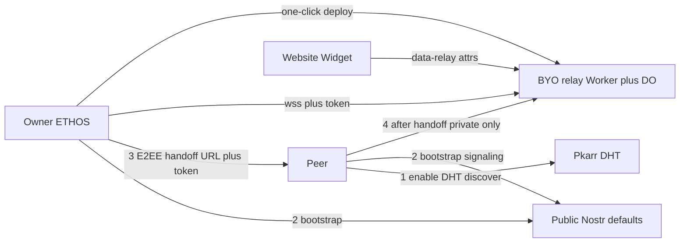

# Design: Opt-in BYO Private Relay

**Date:** 2026-09-20  
**Status:** Approved  
**Related:** [BYO push gateway](./2026-09-19-byo-push-gateway-design.md) (same one-click Cloudflare + portable-contract pattern)

## Problem

ETHOS and the embeddable widget rely on public Nostr relays for WebRTC signaling and encrypted fallback transport (`SIGNAL_KIND` 41002, `RELAY_DATA_KIND` 41003 in `src/lib/iroh.ts`). That works for bootstrap, but:

1. **Privacy** — public operators see metadata (timing, routing, IP-level signals) even though message content is E2EE.
2. **Reliability** — public relays rate-limit or ban bursty ICE signaling; delivery is unpredictable.
3. **No reference BYO path** — users can already paste custom relay URLs (`nexus_custom_relays`), but there is no secure-by-default, one-click deployable reference relay comparable to `push-gateway/`.

ETHOS must not operate shared relays. Users who want a private, robust mesh must bring their own.

## Goals

- Ship a **thin, secure-by-default reference Nostr relay** as a Cloudflare Worker + Durable Object with **one-click Deploy to Cloudflare**.
- Prioritize **private, secure, robust, and fast** communication for owner ↔ peer and owner ↔ widget.
- **Owner-deployed shared relay**: the relay owner deploys once; peers and the website widget use that relay for the relationship.
- Keep **public Nostr defaults** for users who have not configured BYO (pragmatic bootstrap over the internet).
- Peer onboarding: **enable Pkarr DHT → discover peer → bootstrap on public Nostr → E2EE handoff of relay URL + token → switch to private only**.
- Widget: owner injects relay credentials via embed attributes (no DHT in the visitor browser).
- Portable contract: clients speak **Nostr WebSocket + auth**, not Cloudflare-specific APIs.
- All user-facing docs, README, Settings copy, and code identifiers in **English**.

## Non-goals (v1)

- ETHOS-operated or default-hosted relay.
- Full Nostr / broad NIP surface or long event retention.
- Extended invite URLs that embed relay credentials as the **required** peer path (optional later).
- Replacing TURN / direct WebRTC.
- Hard-removing public Nostr defaults globally.
- Automatic retry loops after a failed private-relay handoff (manual control only).
- Advertising relay URL via Pkarr DHT as a v1 feature (document discovery; harden DHT later).

## Decisions (locked)

| Topic | Choice |
|-------|--------|
| Goals | Privacy + reliability; private / secure / robust / fast first |
| Ownership | Owner deploys one shared relay; peers/widget use it |
| Without BYO | Keep today’s `DEFAULT_NOSTR_RELAYS` |
| Protocol | Nostr wire + ETHOS auth and kind allowlist |
| Approach | Thin private Nostr Worker (not full relay, not custom non-Nostr pipe) |
| Peer access | DHT discover → public bootstrap → E2EE handoff → private only |
| Handoff failure | Stay on bootstrap session; clear status; no silent forever-hybrid after successful handoff |
| Retry | **Manual only** — one attempt on handoff or Settings save; user retries explicitly |
| Widget | `data-relay-url` + `data-relay-token` when set → private only |
| Hosting | Cloudflare Worker is reference + one-click; API is portable |
| Process | Superpowers: spec → `writing-plans` → SDD + TDD |

## Architecture

### Roles

- **Relay owner** — deploys `relay/`, configures URL + token in ETHOS Settings (opt-in), connects to the private `wss` for their own mesh.
- **Peer** — finds the owner via Pkarr DHT (or already has a ticket), bootstraps over public Nostr, receives relay credentials over E2EE, then uses only the private relay for that relationship.
- **Widget visitor** — never talks to public Nostr when embed attributes supply the owner’s private relay.
- **Relay** — dumb authenticated pipe: Nostr `EVENT` / `REQ` / `CLOSE` / `EOSE` / `OK` / `NOTICE`. Sees ciphertext and routing metadata only; never plaintext chat content; never participates in E2EE.

### Client policy

| State | Active Nostr relays |
|-------|---------------------|
| No BYO configured | `DEFAULT_NOSTR_RELAYS` (unchanged) |
| Owner opt-in with valid `wss` + token (after successful probe) | Dual-homed: `DEFAULT_NOSTR_RELAYS` + authed private URL (v1; keeps public bootstrap reachable) |
| Peer after successful handoff | Private URL only for that session (process-wide pool in v1) |
| Peer handoff connect failed | Remain on bootstrap (public) transport; show failure; wait for manual retry |
| Widget with `data-relay-*` | Private URL only |
| Widget without `data-relay-*` | Existing behavior (public defaults / as today) |
| Owner disables private relay | Restore `DEFAULT_NOSTR_RELAYS`; clear custom/token URL from active pool |

After a **successful** private switch, do not automatically fall back to public Nostr if the private relay later drops. Normal WebSocket reconnect to the **already selected private URL** is allowed. Returning to public Nostr requires explicit user action (e.g. disable private relay / reset relays).

## Reference implementation: `relay/`

Mirror `push-gateway/` UX and security posture.

### Stack

- Cloudflare Worker front door + **one Durable Object** per deploy (owner mesh)
- WebSocket hibernation for concurrent connections
- Short TTL / bounded in-DO event store (transport buffer, not an archive)
- `wrangler.toml`, Deploy to Cloudflare button, English README
- Setup page on `GET /` (show `wss` URL + auth token once; claim flow analogous to push-gateway)
- Optional Cloudflare Secrets override for advanced operators
- `GET /health` without secrets

### Wire protocol

- Nostr over WebSocket (compatible with `nostr-tools` `SimplePool` usage in ETHOS)
- Auth required on WebSocket upgrade. **Client uses `wss://host/?token=…`** (works with `nostr-tools` URL lists). Worker **must** accept query `token`; may also accept `Authorization: Bearer` for non-ETHOS clients.
- **Kind allowlist:** ETHOS kinds only — `41002` (signaling), `41003` (relay data). Reject all other kinds.
- Payload limits: max event size; rate limits per connection and per token (ICE-burst-friendly but capped)
- Fail closed without valid token

### Portability

The contract is: authenticated Nostr WebSocket + the security controls above. Any host may implement it. Cloudflare is the recommended one-click path, not a client lock-in.

## Client integration

### Settings (owner)

Extend the existing relay Settings UI (`App.tsx` + `iroh.setRelays` / `nexus_custom_relays`):

- **Enable private relay** — boolean, default false
- **Relay URL** — `wss://…` only (client rejects non-TLS)
- **Auth token** — from setup page
- Help text: one-click Cloudflare deploy → open Worker URL → copy URL + token → paste into Settings (same narrative as push-gateway)
- **Retry private relay** control when handoff or connect previously failed
- Reset relays restores `DEFAULT_NOSTR_RELAYS` and clears private opt-in

### Peer handoff

1. User enables Pkarr DHT and discovers the peer (or pastes a ticket).
2. `connectByTicket` bootstraps over current defaults (public Nostr) until an E2EE session exists.
3. Owner includes `relayUrl` + `relayAuthToken` in the encrypted handshake / control path (same pattern as push prefs: `pushHandshakeFields` / `storePeerPushFromSignal` in `iroh.ts`).
4. Peer stores credentials and attempts **one** switch of the active pool to the private `wss` (token attached as documented).
5. On success: private only for that relationship; UI shows private relay status.
6. On failure: keep bootstrap session; status copy exactly **Private relay unavailable**; **no auto-retry**. Manual retry via UI / re-save Settings / new handoff after owner fixes deploy.

### Widget

- Optional `data-relay-url` and `data-relay-token` on the embed script (document in README embed table).
- When both present and valid: widget initializes `iroh` / pool against private relay only.
- When absent: keep current public-default behavior.
- No DHT discovery inside the widget for v1.

### Discovery note

v1 documents “enable DHT, find peer, then handoff.” Publishing the relay URL into Pkarr records is a later robustness improvement, not required to ship the Worker + handoff path.

## Security (secure-by-default)

Target operators: people who are not security experts. Defaults must be safe.

### Built-in controls (required)

1. Auth token required on WebSocket upgrade — no anonymous REQ/EVENT.
2. Kind allowlist — only ETHOS kinds; reject everything else.
3. Payload size limits and rate limits (per connection + per token).
4. Short TTL and bounded store — no unbounded history.
5. No content logging — never log event `content`. Optional aggregate counters (connection count, reject count) without payloads.
6. Secrets via setup bootstrap (KV) and/or Cloudflare Secrets override — never commit secrets.
7. Client accepts only `wss://` for private relay URLs.
8. Authorization is the token, not `Origin` (widgets run on arbitrary sites).
9. Fail closed on misconfiguration / missing auth.
10. After successful private switch, no automatic return to public Nostr.

### Threat model (summary)

| Threat | Mitigation |
|--------|------------|
| Open relay / spam | Token + rate limits + kind allowlist |
| Stolen Worker URL alone | Token required; rotate via docs |
| Metadata on public Nostr | Accepted only during bootstrap until handoff succeeds |
| Operator logs ciphertext | Default paths never log content |
| CF account compromise | Same class as push-gateway — rotate token |
| Silent privacy regress after BYO | No auto-fallback to public after successful private switch |

### Explicit non-protections

- Relay sees timing, size, and IP-level metadata.
- Stolen token grants full relay access until rotated.
- Relay does not verify chat E2EE.
- Bootstrap handshake metadata remains visible on public Nostr until handoff succeeds.

## Retry policy (locked)

- **One** automatic connect attempt when handoff is received or when the owner saves private-relay Settings.
- On failure: stay on bootstrap; clear status; stop.
- Further attempts only when the user explicitly retries (button, re-save, or rotate token and retry).
- No timed auto-retry loop (no 60s backoff campaign).

## Testing

- Worker: auth reject, kind reject, happy-path fan-out, TTL eviction, rate limit.
- Client: parse/store handoff fields; post-success relay list is private only; failure keeps bootstrap; no auto-retry.
- Widget: `data-relay-*` skips public defaults; missing attrs preserve current behavior.
- Manual: Deploy to Cloudflare → setup page → owner Settings → DHT connect → handoff → signaling/chat on private relay; kill Worker → status + manual retry; widget with attrs does not hit public relays.

## Success criteria

- Non-expert can one-click deploy a private relay and complete setup without CLI crypto.
- After successful handoff, peer/widget mesh traffic for that relationship does not use public Nostr.
- Without BYO, behavior remains today’s public defaults.
- Handoff failure does not drop an existing bootstrap chat session.
- No ETHOS-hosted relay; English throughout user-facing surfaces.

## Implementation follow-up

After this spec is approved as written:

1. Create implementation plan via Superpowers `writing-plans` at `docs/superpowers/plans/2026-09-20-byo-private-relay.md` (TDD bite-sized tasks, SDD header).
2. Execute with `subagent-driven-development` + `test-driven-development` (fresh subagent per task, review gates). Do not implement outside that plan.
